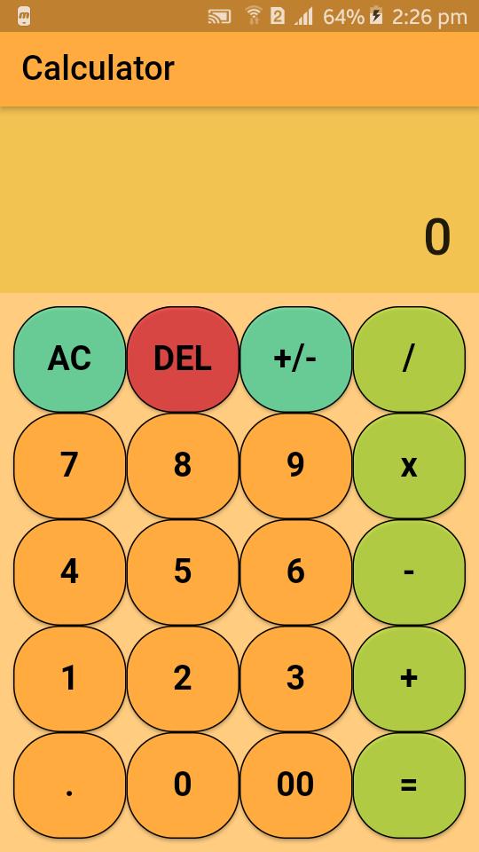

# Calculator
It is an application that can perform basic operations like: additon, subtraction, multiplication and division. This application is made using Dart to understand the basic functioning of Flutter. 

## About Application
This application performs two operands calculation at a time. 

